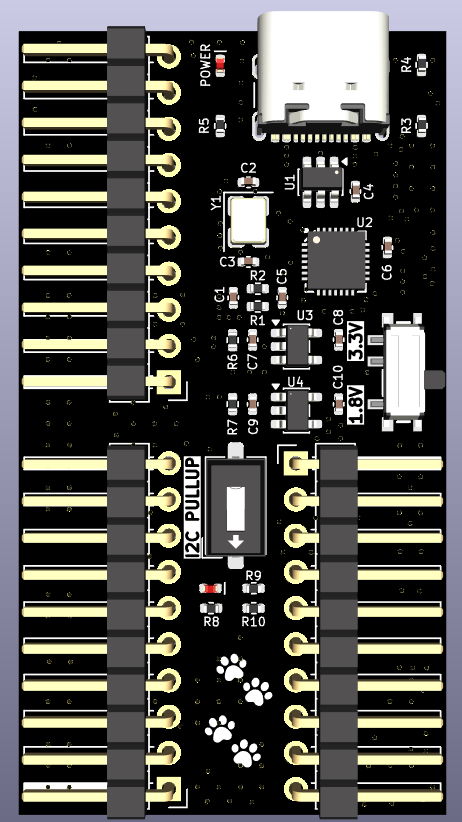
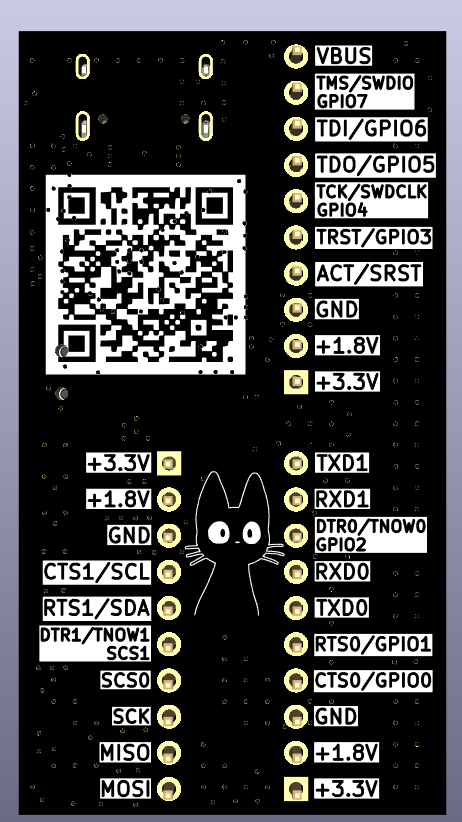

# RB-347

**A compact, multi-protocol USB interface module based on the CH347F**

RB-347 is a small USB interface and debugging module built around the WCH
CH347F. It provides several commonly used digital interfaces from a single
USB-C connection, making it useful for embedded development, board bring-up,
programming, debugging, protocol testing, and laboratory work.

Unlike a basic single-function USB adapter, the CH347F can expose multiple
hardware interfaces through one device. This allows compatible protocols to be
used at the same time, subject to the CH347F operating mode, pin multiplexing,
driver, and host-software support.

## PCB gallery

<table>
  <tr>
    <th width="50%">Top</th>
    <th width="50%">Bottom</th>
  </tr>
  <tr>
    <td></td>
    <td></td>
  </tr>
</table>

## Supported interfaces

- Two UART channels with hardware flow-control and modem-control signals
- SPI with clock, MOSI, MISO, and chip-select signals
- I²C with onboard SDA and SCL pull-up resistors
- JTAG for programming and debugging compatible targets
- SWD signals shared with the JTAG pins
- Multiplexed GPIO signals for general-purpose control

Some CH347F pins have more than one function. Interfaces that use the same
multiplexed pins cannot be enabled independently at the same time; select a
compatible operating mode for the required combination.

## Hardware features

- WCH CH347F USB high-speed multi-interface bridge
- USB-C connector for host connection and board power
- USB data-line ESD protection
- USB-C configuration resistors
- 8 MHz external crystal
- Separate regulated 3.3 V and 1.8 V rails
- Slide switch for selecting the I/O voltage between 3.3 V and 1.8 V
- DIP switch for enabling or disabling the onboard I²C pull-up resistors
- LED indicator for the I²C pull-up resistor status
- Power indicator LED
- Three 10-pin, 2.54 mm interface headers
- Onboard I²C pull-up resistors
- Compact PCB designed in KiCad

## Exposed signals

The headers provide access to the CH347F interface and control signals,
including:

| Group | Signals |
| --- | --- |
| UART 0 | `TXD0`, `RXD0`, `CTS0/GPIO0`, `RTS0/GPIO1`, `DTR0/TNOW0/GPIO2` |
| UART 1 / I²C | `TXD1`, `RXD1`, `CTS1/SCL`, `RTS1/SDA`, `DTR1/TNOW1/SCS1` |
| SPI | `SCK`, `MOSI`, `MISO`, `SCS0`, `SCS1` |
| JTAG / SWD / GPIO | `TCK/SWDCLK/GPIO4`, `TMS/SWDIO/GPIO7`, `TDI/GPIO6`, `TDO/GPIO5`, `TRST/GPIO3`, `ACT/SRST` |
| Control and power | `RST`, `VIO`, `VBUS`, `3.3V`, and `GND` |

## Configuration switches

### I/O voltage

The slide switch selects the voltage used by the CH347F interface pins:

- **3.3 V** for targets that use 3.3 V logic
- **1.8 V** for targets that use 1.8 V logic

Set the switch to match the target's logic voltage before connecting any signal
pins. Do not change the I/O voltage while the module is connected to an active
target.

### I²C pull-ups

The DIP switch enables or disables the onboard pull-up resistors on the I²C
`SDA` and `SCL` lines. Enable them when the bus requires pull-ups and suitable
pull-ups are not already present. Disable them when the target board provides
its own pull-ups or when these pins are used for another multiplexed function.
The I²C indicator LED turns on when the onboard pull-up resistors are enabled
and turns off when they are disabled, providing a clear visual status.

> [!CAUTION]
> Verify the target voltage and the selected I/O configuration before connecting
> RB-347 to another board. Never assume that a target is 5 V tolerant, and do
> not short a target's power rail to USB `VBUS` or another driven supply.

## Typical applications

- USB-to-UART console and serial communication
- SPI and I²C device evaluation
- Flash-memory programming
- JTAG or SWD target programming and debugging
- Automated hardware testing and production fixtures
- Protocol bridging and embedded-system development

---

  Built as a compact, versatile interface for embedded development and debugging.

